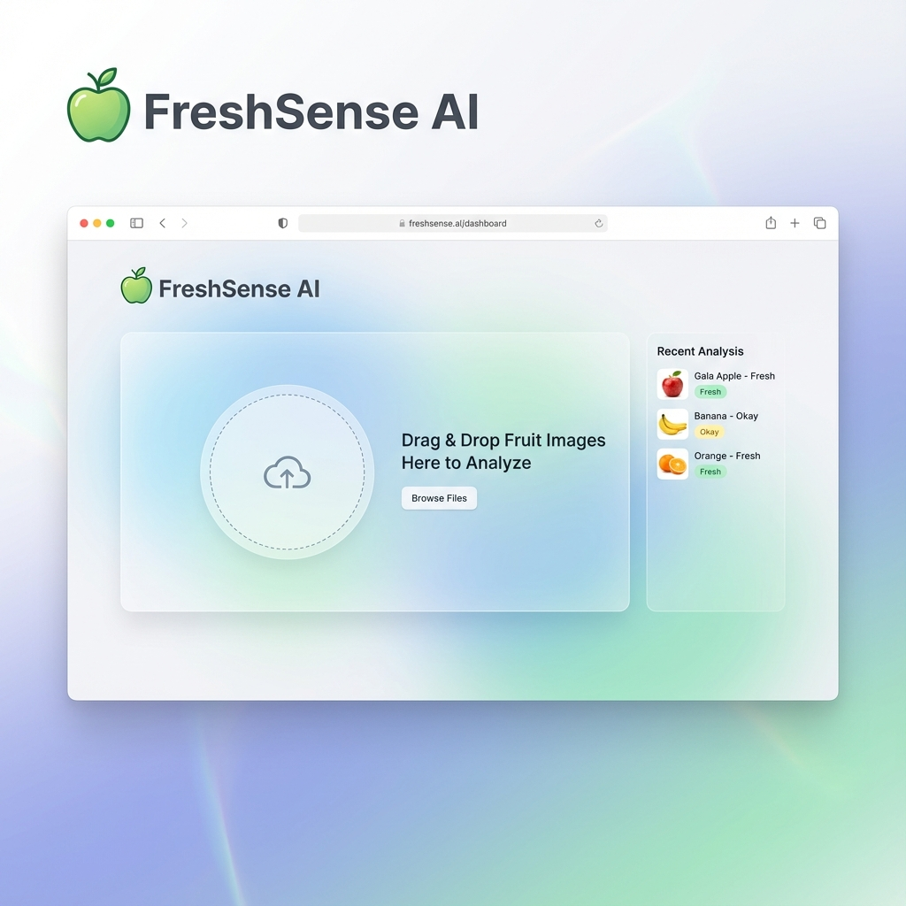

# 🍎 FreshSense AI - Intelligent Food Freshness Detector



A production-ready computer vision web application that instantly assesses the freshness of fruits (apples, bananas, oranges) using advanced AI. Built with **React**, **Tailwind CSS**, and **Hugging Face Inference API**.

## ✨ Features

- **Real-Time AI Analysis**: Integrates with Hugging Face's `freshvision` model to distinguish between Fresh and Rotten fruits.
- **Visual Feedback**: Intuitive color-coded results (Fresh = Green, Rotten/Avoid = Red) with confidence scores.
- **Modern UI/UX**:
    - **Glassmorphism Design**: Sleek, modern interface with transparency and blur effects.
    - **Smooth Animations**: Powered by `framer-motion` for a premium user experience.
    - **Drag & Drop**: Effortless image upload with instant preview.
- **Analysis History**: Automatically tracks your session scans with a history sidebar.
- **Professional Branding**: Consistent "FreshSense AI" branding with custom assets.

## 🛠️ Tech Stack

- **Frontend**: React 18, Vite
- **Styling**: Tailwind CSS, PostCSS
- **Animations**: Framer Motion
- **Icons**: Lucide React
- **AI/ML Backend**: Hugging Face Inference API (REST)
- **State Management**: React Hooks (useState, useEffect)

## 🚀 Getting Started

### Prerequisites

- Node.js (v16 or higher)
- A free [Hugging Face Account](https://huggingface.co/) for an API key.

### Installation

1.  **Clone the repository**
    ```bash
    git clone https://github.com/selvaganapathycoder/FreshSense-AI.git
    cd FreshSense-AI
    ```

2.  **Install Dependencies**
    ```bash
    npm install
    ```

3.  **Environment Setup**
    Create a `.env` file in the root directory and add your API Key:
    ```bash
    VITE_HF_API_KEY=your_hugging_face_key_here
    ```

4.  **Run Locally**
    ```bash
    npm run dev
    ```
    Open `http://localhost:5173` in your browser.

## 🧠 How It Works

1.  **Image Upload**: The user selects or drags a fruit image into the UI.
2.  **API Request**: The app sends the binary image data to the hosted `devdezzies/freshvision` model on Hugging Face.
3.  **Inference**: The model analyzes features (color, texture, spots) to classify the fruit as "fresh" or "rotten".
4.  **Result Parsing**: The frontend processes the JSON response, maps the labels to user-friendly tags (Fresh/Avoid), and displays the result with animation.

## 📄 License

This project is open source and available under the [MIT License](LICENSE).

---

**Developed by [Selva Ganapathy](https://github.com/selvaganapathycoder)**
